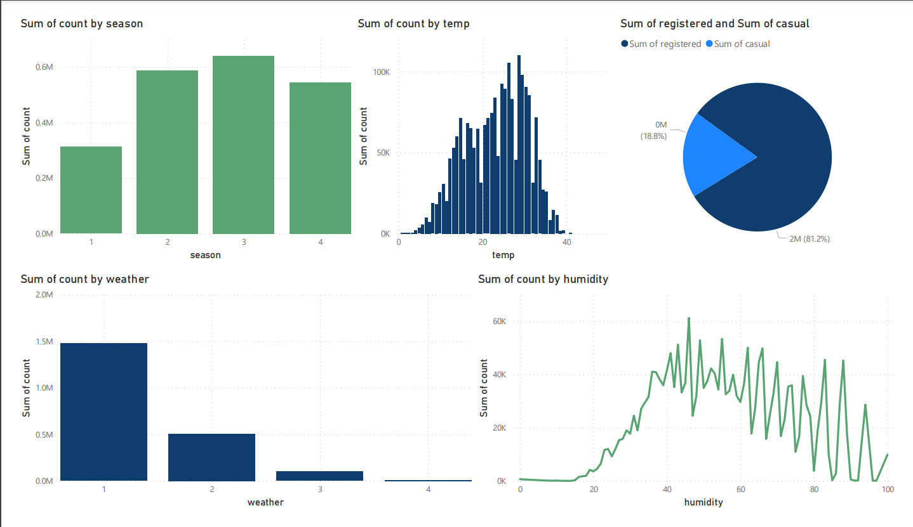

# Yulu-HTesting

### About The Data
​
This dataset provides insights into the usage patterns of YULU bike sharing services. It includes a variety of factors such as weather conditions, time, and user type, which could influence bike rental behaviors.
​
**Target Columns**
​
 - Casual: Count of Casual Users 
 - Registered: Count of Registered Users
 - Count : Casual + Registered
​
**Note on Registration:** YULU's policy requires a refundable security deposit of Rs 100 for registration. This aspect could influence user decisions to register and use the service regularly.
​
**Temperature Columns**
​
  - temp: Ambient temperature as measured by standard devices, in Celsius.
  - atemp: 'Feels like' temperature, considering factors like humidity and wind, in Celsius.
​
**Column Profiling:**
​
 - datetime: Date and time of the bike rental.
​
 - season: Categorical variable representing the season (1: Spring, 2: Summer, 3: Fall, 4: Winter).
​
 - holiday: Indicates if the day is a public holiday (1: Holiday, 0: Non-holiday).
​
 - workingday: Identifies working days (1: Working day, 0: Weekend or holiday).
​
 - weather: Categorical variable representing weather conditions:
  - 1: Clear, few clouds, partly cloudy.
  - 2: Mist + cloudy, mist + broken clouds, mist + few clouds.
  - 3: Light snow, light rain + thunderstorm + scattered clouds, light rain + scattered clouds.
  - 4: Heavy rain + ice pellets + thunderstorm + mist, snow + fog.
  
 - humidity: Relative humidity in percentage.
​
 - windspeed: Wind speed in km/h.
​
 - count: Total count of rented bikes, including both casual and registered users.
****

### Goal:
1. Which variables are significant in predicting the demand for shared electric cycles in the Indian market?✅
2. Select an appropriate test to check whether:
    
    - Working Day has effect on number of electric cycles rented✅

    - No. of cycles rented similar or different in different seasons✅

    - No. of cycles rented similar or different in different weather✅

    - Weather is dependent on season (check between 2 predictor variable)✅
****

### Plan
1. Before finding out some insights lets focus on checking null value, outliers and prepare overall data, also we delete datetime column by adding the [year,month] columns

2. Our main focus will be on comparing other columns with these 3 columns [casual,register,count] because they explore about the count of users which is the main focus of Yulu's 
3. We will compare and try to find relation between variables
4. At each set of visualization we provide a "short analysis (SA)" to understand what the visualization want to say
5. After that we will start our main part that is Hypothesis Testing
6. We have to use various test to check wether we have to Reject H0 or Accept H0
7. So after solving each problem we markdown the final Answer

**Note : Please feel free to suggest any modifications, improvements, or corrections. I'm open to learning and improving** 
****

### Steps:
1. Data Exploration & EDA ✅
2. Relation Between Independent and Dependent Variables✅
3. Hypothesis Testing (Shapiro, Levene , Whiteneyuu, Kruskal's Wallis, Dunn's Test)✅
****

### Reference:
   - https://en.wikipedia.org/wiki/Kruskal%E2%80%93Wallis_one-way_analysis_of_variance
   - https://www.kaggle.com/code/ekrembayar/a-b-testing-step-by-step-hypothesis-testing
   - https://www.statology.org/dunns-test/
   ****

### Short Forms
 - Short Analysis : SA
 ****
